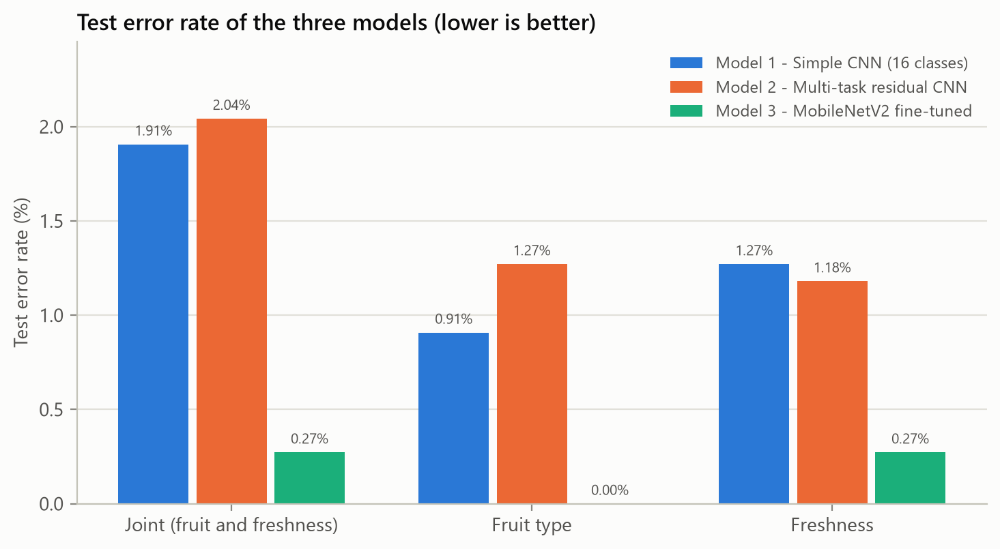
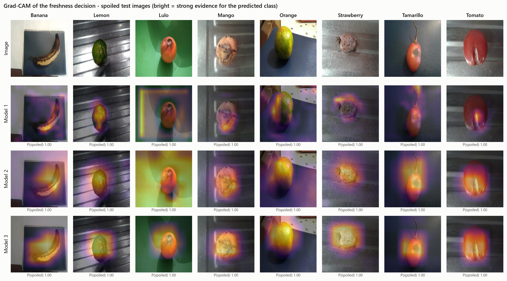

# Fresh and Rotten Fruit Classification

Course project for Deep Learning at the National Economics University (NEU), instructor Dr. Nguyễn Thị Kim Ngân.

Group: Triệu Hải Đăng Trình, Trương Hoàng Tùng, Nguyễn Đại Quân, Nguyễn Dương Hiếu.

We classify photos of 8 kinds of fruit as fresh or spoiled and compare three CNNs built with TensorFlow/Keras:

1. **Model 1** - a simple Sequential CNN (5 conv blocks + dense layers) with one softmax over the 16 classes (8 fruits x fresh/spoiled).
2. **Model 2** - a multi-task CNN made of residual blocks (Functional API) with two outputs: fruit type (softmax) and freshness (sigmoid).
3. **Model 3** - MobileNetV2 pretrained on ImageNet with the same two outputs, trained in two stages: first only the new layers, then fine-tuning from block 13.

## Data

[Spoiled and Fresh Fruit Inspection Dataset](https://data.mendeley.com/datasets/6ps7gtp2wg/1) (Pachon Suescun et al., 2020, CC BY 4.0): 16,000 RGB images of 224 x 224, 1,000 per class. Fruits: banana, lemon, lulo, mango, orange, strawberry, tamarillo, tomato.

- 1,273 images are byte-identical copies and one photo is stored under both labels. After removing them 14,726 images are left.
- The photos were taken in bursts, so neighbouring images are often almost the same. With a random split by image, 6.5 % of the test images would have a near-copy in the training set. We group related images (perceptual hash + small thumbnails) and put whole groups into one split, stratified by class: 10,320 train / 2,203 validation / 2,203 test images. The split used for all experiments is in `data/splits/`.

## Results (test set, 2,203 images)

"Joint" means that both the fruit and the freshness are right (16 classes).

| Model | Joint accuracy | Joint F1 (macro) | Fruit accuracy | Freshness F1 | Wrong images | Parameters |
|---|---|---|---|---|---|---|
| Model 1 - simple CNN | 98.09 % | 0.979 | 99.09 % | 0.988 | 42 | 3.75 M |
| Model 2 - multi-task residual CNN | 97.96 % | 0.979 | 98.73 % | 0.989 | 45 | 4.99 M |
| Model 3 - MobileNetV2 fine-tuned | **99.73 %** | **0.997** | **100 %** | **0.998** | **6** | 2.51 M |



Ablations:

- **Data augmentation** (flips, rotation, zoom, brightness, contrast). Without it Model 1 drops to 92.37 % (168 wrong images): it overfits, since most of its weights are in the dense layer after Flatten. Model 2, which uses global average pooling, stays the same (98.05 %), and Model 3 gets a little worse (99.32 %).
- **Number of fine-tuned layers** (Model 3, all runs start from the same stage-1 weights): only the new layers 98.18 %, from block 16 99.36 %, block 13 99.73 %, block 10 99.77 %, block 6 99.64 %, all layers 99.86 %. Fine-tuning helps a lot for freshness. After block 13 the differences are only a few images, while training all layers is almost twice as slow.

Grad-CAM shows that Model 3 mostly looks at the fruit and its spoiled spots, while the two smaller CNNs sometimes look at the background:



More tables are in `reports/`: `results_summary.md`, `error_analysis.md`, `resource_report.md` and `split_audit.txt`.

## Repository

```text
configs/       data and training settings
data/splits/   the train/val/test split used for all experiments
demo/          a few test images for the demo
notebooks/     01 data checks, 02 demo with Grad-CAM
scripts/       download, audit, split, train, evaluate, Grad-CAM, predict
src/           data pipeline, models, callbacks, metrics
tests/         pytest checks for the split, the pipeline and the models
figures/, reports/   results made by the scripts
```

## How to run

Python 3.12 with TensorFlow 2.21 (everything was trained on a CPU).

```bash
pip install -r requirements.txt
python scripts/download_data.py
python scripts/audit_data.py
python scripts/make_splits.py        # gives the same split as data/splits/
python scripts/run_experiments.py    # all 11 training runs, takes many hours on a CPU
python scripts/model_report.py
python scripts/evaluate.py
python scripts/gradcam.py
python scripts/error_analysis.py
python scripts/predict.py demo/demo_images/*.jpg
pytest tests
```

One model can also be trained on its own, e.g. `python scripts/train.py --model simple_cnn` (or `multitask_cnn`, `transfer`). The trained weights are not in the repository because of their size.
