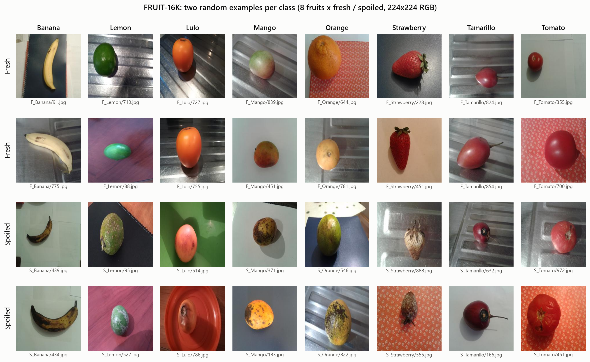
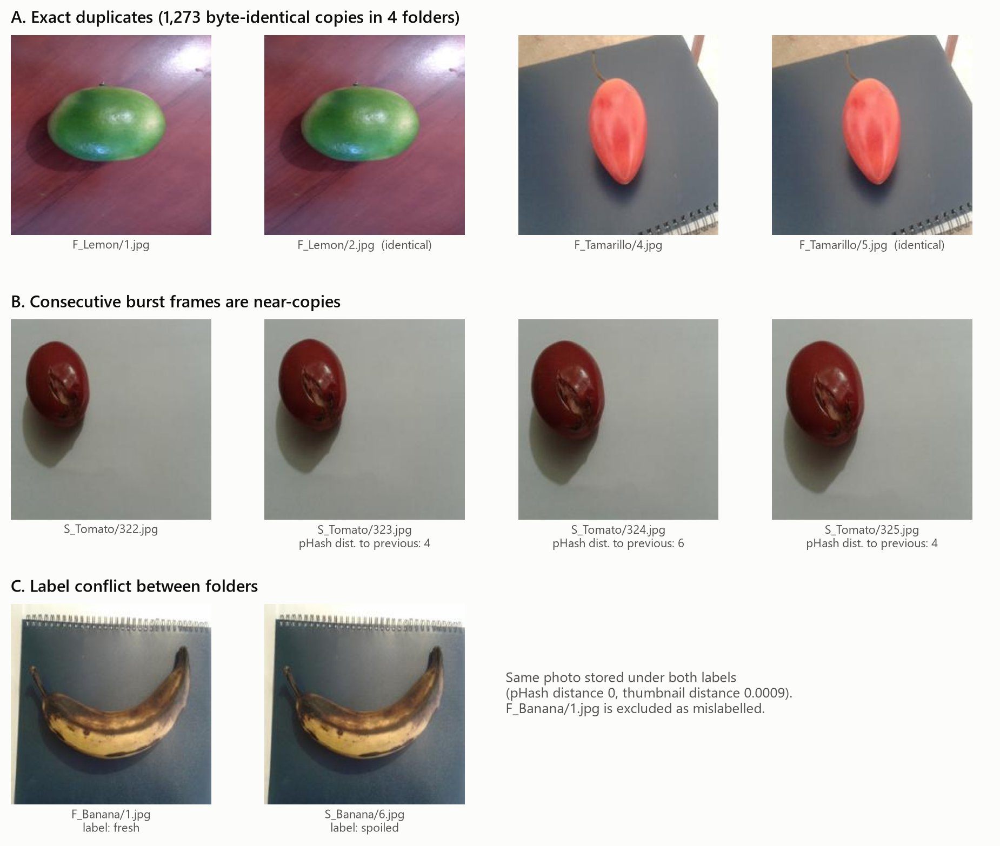
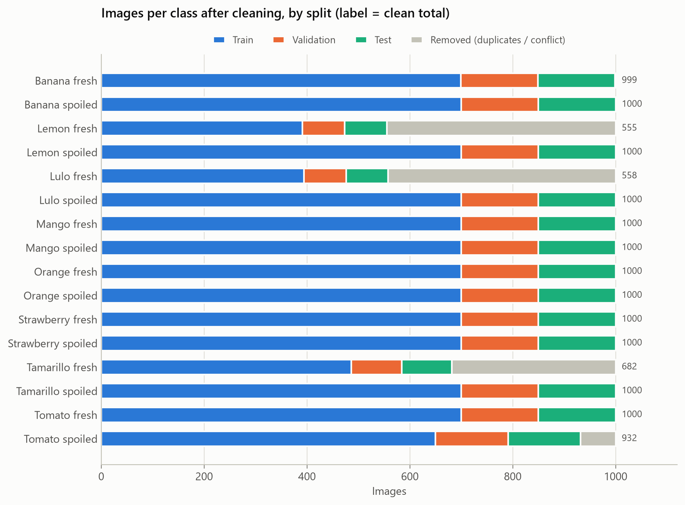
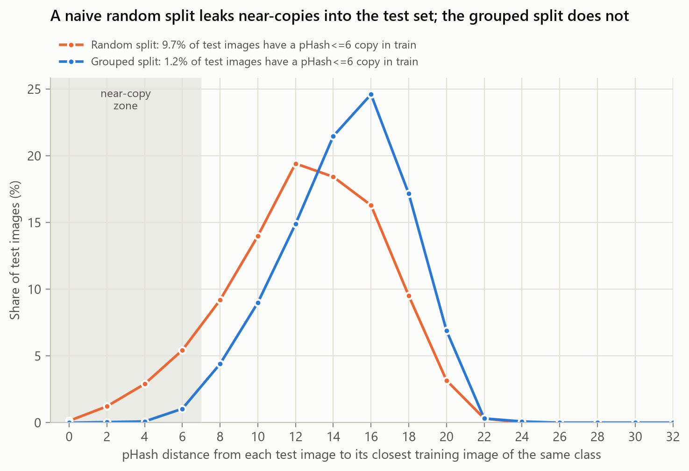
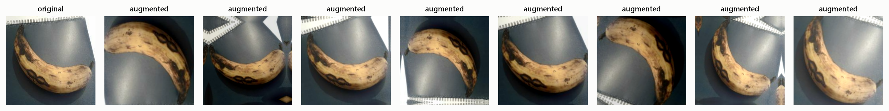
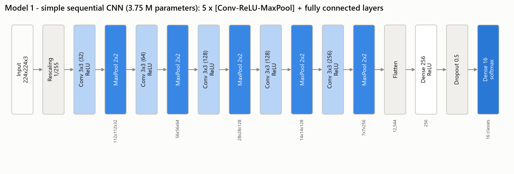
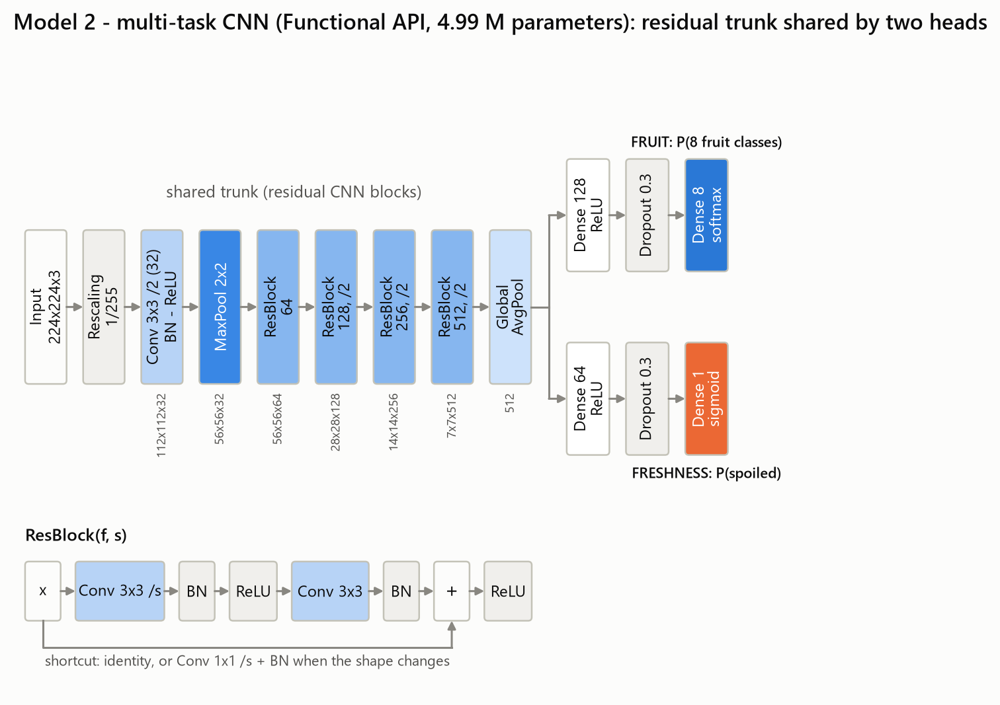
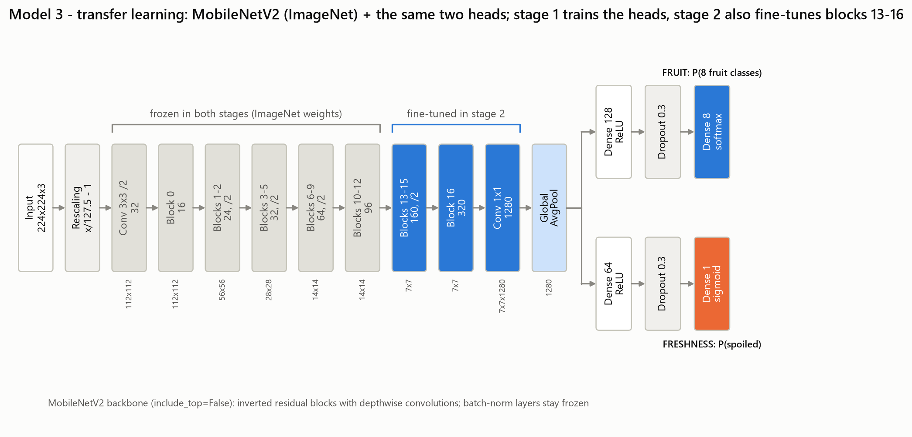

# PHẦN 2. ỨNG DỤNG THỰC TIỄN

## I. Mô tả bài toán

* **Tên đề tài:** Phân loại trái cây tươi và hỏng bằng mạng nơ-ron tích chập (Fresh and Rotten Fruit Classification).
* **Bối cảnh:** kiểm tra chất lượng trái cây trước khi phân phối hiện vẫn chủ yếu làm thủ công, tốn công và dễ sai sót. Một hệ thống dựa trên ảnh có thể đồng thời nhận ra loại quả và đánh giá quả còn tươi hay đã hỏng sẽ hỗ trợ tự động hoá khâu phân loại và kiểm soát chất lượng - đúng mục đích mà nhóm tác giả bộ dữ liệu đặt ra.
* **Mục tiêu nghiên cứu:**
    1. Xây dựng và so sánh ba mô hình CNN với mức độ phức tạp tăng dần trên cùng một bộ dữ liệu: (1) CNN tuần tự đơn giản tự thiết kế; (2) CNN phức tạp tự thiết kế từ các khối phần dư, học đa nhiệm với hai đầu ra; (3) mô hình học chuyển giao từ MobileNetV2 huấn luyện sẵn trên ImageNet, có tinh chỉnh.
    2. Đánh giá ảnh hưởng của tăng cường dữ liệu và của số lớp được tinh chỉnh (nghiên cứu cắt bỏ - ablation).
    3. Dùng Grad-CAM để kiểm tra vùng ảnh nào quyết định dự đoán tươi / hỏng.
* **Đầu vào:** một ảnh màu RGB chụp một quả, kích thước $224 \times 224$ điểm ảnh.
* **Đầu ra:**
    * loại quả - một trong 8 lớp: chuối (banana), chanh (lemon), lulo, xoài (mango), cam (orange), dâu tây (strawberry), cà chua thân gỗ (tamarillo), cà chua (tomato);
    * độ tươi - tươi (fresh) hoặc hỏng (spoiled), kèm xác suất $P(\text{hỏng})$. **Lớp "hỏng" được chọn là lớp dương tính** (positive class), vì mục tiêu kiểm soát chất lượng là phát hiện quả hỏng;
    * tương đương với một nhãn kết hợp trong 16 lớp (ví dụ `Mango_spoiled`), mã hoá $\text{nhãn kết hợp} = 2 \times \text{nhãn loại quả} + \text{nhãn độ tươi}$.
* **Tóm tắt các công việc đã thực hiện:**
    1. Kiểm định dữ liệu: đọc thử toàn bộ ảnh, thống kê kích thước - kênh màu, phát hiện ảnh trùng lặp (SHA-256) và ảnh gán nhãn mâu thuẫn.
    2. Làm sạch dữ liệu và chia tập train / validation / test theo tỉ lệ 70 / 15 / 15, phân tầng theo lớp và **chống rò rỉ dữ liệu** (giữ các ảnh chụp liên tiếp gần giống nhau trong cùng một tập).
    3. Xây dựng đường ống dữ liệu dùng chung: giải mã ảnh, chuẩn hoá, tăng cường dữ liệu chỉ cho tập huấn luyện.
    4. Thiết kế, huấn luyện và tinh chỉnh ba mô hình với cùng một quy trình (dừng sớm, lưu mô hình tốt nhất, giảm tốc độ học).
    5. Nghiên cứu cắt bỏ: có / không tăng cường dữ liệu; số khối MobileNetV2 được tinh chỉnh.
    6. Đánh giá trên tập kiểm tra bằng accuracy, precision, recall, F1-score, ma trận nhầm lẫn và thời gian suy luận; trực quan hoá Grad-CAM và phân tích lỗi.

## II. Mô tả bộ dữ liệu

* **Tên và nguồn:** Spoiled and Fresh Fruit Inspection Dataset (FRUIT-16K) - Pachon Suescun, Pinzón Arenas và Jiménez-Moreno, Đại học Quân sự Nueva Granada (Colombia), công bố năm 2020 trên Mendeley Data.
* **Link tải:** <https://data.mendeley.com/datasets/6ps7gtp2wg/1> (DOI: 10.17632/6ps7gtp2wg.1), giấy phép CC BY 4.0.
* **Số lượng ảnh:** 16.000 ảnh JPEG, gồm 8 loại quả; mỗi loại 2.000 ảnh, một nửa là quả tươi và một nửa là quả hỏng. Dữ liệu được tổ chức thành 16 thư mục `F_<Quả>` (tươi) và `S_<Quả>` (hỏng), mỗi thư mục 1.000 ảnh đánh số `1.jpg` - `1000.jpg` theo thứ tự chụp.
* **Đối tượng trong ảnh:** mỗi ảnh chụp một quả thuộc một trong 8 loại trên, đặt trên nhiều nền khác nhau (bồn rửa inox, mặt bàn gỗ, bìa sổ, khăn trải bàn, giấy trắng), với khoảng cách chụp, góc xoay và ánh sáng thay đổi. Quả hỏng có các dấu hiệu như vết thâm, đốm đen, nấm mốc, vỏ nhăn, đổi màu (Hình 1).
* **Kích thước ảnh:** tất cả 16.000 ảnh đều có kích thước $224 \times 224$ điểm ảnh, 3 kênh màu RGB, dung lượng trung bình khoảng 6 KB (nén JPEG mạnh). Giá trị trung bình / độ lệch chuẩn của điểm ảnh (thang [0, 1]) sau làm sạch: R 0,494 / 0,209; G 0,424 / 0,195; B 0,389 / 0,197.

**Kết quả kiểm định dữ liệu.** Không có ảnh lỗi hay không đọc được; mọi ảnh đều $224 \times 224$ RGB. Tuy nhiên phát hiện hai vấn đề quan trọng (Hình 2):

* **1.273 ảnh trùng lặp hoàn toàn** (trùng mã băm SHA-256), luôn là các cặp ảnh liền nhau (ví dụ `99.jpg` = `100.jpg`), tập trung ở 4 thư mục: F_Lemon (445), F_Lulo (442), F_Tamarillo (318), S_Tomato (68).
* **1 ảnh gán nhãn mâu thuẫn:** `F_Banana/1.jpg` (nhãn "tươi") chính là ảnh `S_Banana/6.jpg` (nhãn "hỏng") - khoảng cách perceptual hash bằng 0; quả chuối trong ảnh rõ ràng đã hỏng.

Ngoài ra, ảnh được chụp theo từng loạt nên các ảnh liền nhau thường gần như giống hệt (cùng quả, cùng tư thế, cùng nền).

## III. Thiết kế mô hình CNN

### 1. Tiền xử lý dữ liệu: làm sạch, chuẩn hoá và tăng cường

**Làm sạch.** Loại 1.273 bản sao trùng lặp (giữ ảnh đầu tiên của mỗi cặp) và loại ảnh gán nhãn sai `F_Banana/1.jpg`. Còn lại **14.726 ảnh**; các lớp trở nên hơi mất cân bằng: Lemon_fresh 555, Lulo_fresh 558, Tamarillo_fresh 682, Tomato_spoiled 932, Banana_fresh 999, các lớp còn lại 1.000 ảnh.

**Chia tập chống rò rỉ dữ liệu.** Nếu chia ngẫu nhiên từng ảnh, các ảnh gần như giống hệt nhau của cùng một loạt chụp sẽ rơi vào cả tập huấn luyện và tập kiểm tra, khiến kết quả kiểm tra phản ánh khả năng "nhớ" hơn là khả năng tổng quát hoá. Chúng tôi đo, với mỗi ảnh kiểm tra, ảnh huấn luyện cùng lớp giống nó nhất theo perceptual hash (pHash, 64 bit) và so sánh ba cách chia (Bảng 1).

*Bảng 1. Tỉ lệ ảnh kiểm tra có "bản sao gần giống" trong tập huấn luyện*

| Cách chia | pHash ≤ 6 | pHash ≤ 10 |
|---------------------------------------|-------------:|-------------:|
| Chia ngẫu nhiên phân tầng (từng ảnh) | 9,7 % | 32,9 % |
| Giữ 25 ảnh liên tiếp trong cùng một tập | 3,9 % | 20,3 % |
| **Cách chia được chọn: nhóm 25 ảnh liên tiếp + gộp ảnh gần trùng** | **1,2 %** | **14,6 %** |

Cách chia được chọn gồm hai bước:

1. **Lập nhóm:** trong mỗi thư mục lớp, cứ 25 ảnh liên tiếp tạo thành một nhóm (một loạt chụp); hai ảnh cùng lớp cũng được gộp vào một nhóm nếu chúng gần trùng nhau - pHash cách nhau không quá 6 bit **và** hoặc điểm ảnh gần như giống hệt (sai khác trung bình trên ảnh thu nhỏ $16 \times 16$ không quá 0,03), hoặc cách nhau không quá 50 ảnh (cùng một quả chụp lại dưới ánh sáng khác).
2. **Phân nhóm vào các tập:** toàn bộ nhóm được đưa vào train, validation hoặc test, thực hiện **riêng cho từng lớp trong 16 lớp** (phân tầng), nhóm lớn xếp trước, mỗi nhóm vào tập còn thiếu nhiều nhất so với tỉ lệ 70 / 15 / 15 (seed 42, kết quả luôn tái lập được).

Kiểm tra sau khi chia: không có ảnh, mã băm hay nhóm nào xuất hiện ở hai tập; không có cặp ảnh gần trùng nào nằm ở hai tập khác nhau; tỉ lệ mỗi lớp lệch khỏi mục tiêu không quá 1,3 điểm phần trăm (Hình 3, Hình 4).

*Bảng 2. Số mẫu trong ba tập dữ liệu*

| Tập | Số ảnh | Tỉ lệ | Mục đích sử dụng |
|------------------|-----------:|----------:|------------------------------------|
| Huấn luyện (training) | 10.320 | 70,1 % | học trọng số mô hình |
| Kiểm định (validation) | 2.203 | 15,0 % | dừng sớm, chọn epoch tốt nhất, điều chỉnh tốc độ học, quyết định trong các thí nghiệm ablation |
| Kiểm tra (test) | 2.203 | 15,0 % | chỉ dùng một lần để đánh giá cuối cùng |

**Thay đổi kích thước và chuẩn hoá.** Ảnh được giải mã thành tensor $224 \times 224 \times 3$ (đúng kích thước gốc nên không cần thay đổi kích thước). Bước chuẩn hoá được đặt thành **lớp đầu tiên của mỗi mô hình**, nhờ vậy mô hình đã lưu có thể nhận trực tiếp ảnh gốc khi triển khai:

* Mô hình 1 và 2: `Rescaling(1/255)` đưa điểm ảnh về $[0, 1]$;
* Mô hình 3: $x/127{,}5 - 1$ đưa về $[-1, 1]$ - đúng miền giá trị mà trọng số ImageNet của MobileNetV2 được huấn luyện.

**Tăng cường dữ liệu (chỉ cho tập huấn luyện).** Dùng các lớp tiền xử lý của Keras, sinh giá trị ngẫu nhiên mới ở mỗi epoch: lật ngang và lật dọc, xoay tối đa $\pm 36°$, phóng to - thu nhỏ $\pm 15\%$, độ sáng $\pm 15\%$, độ tương phản $\pm 15\%$ (Hình 5). Không thay đổi sắc độ màu vì màu sắc (nâu hoá, đốm thâm, nấm mốc) là dấu hiệu chính của quả hỏng. Đường ống `tf.data` lưu đệm (cache) dữ liệu ảnh đã nén trong bộ nhớ, xáo trộn tập huấn luyện mỗi epoch, chia batch 32 và nạp trước (prefetch).

### 2. Mô hình 1 - CNN tuần tự đơn giản

Mô hình 1 được xây dựng bằng **Keras Sequential API** theo mẫu kinh điển của LeNet / AlexNet: năm khối [Tích chập $3 \times 3$ - ReLU - Gộp cực đại $2 \times 2$] với số kênh 32 - 64 - 128 - 128 - 256, sau đó duỗi phẳng và hai lớp kết nối đầy đủ (Hình 6, Bảng 3). Lớp đầu ra softmax dự đoán trực tiếp **16 lớp kết hợp**; loại quả và độ tươi được suy ra từ 16 xác suất: $P(\text{quả}) = P(\text{quả, tươi}) + P(\text{quả, hỏng})$ và $P(\text{hỏng})$ bằng tổng 8 xác suất của các lớp "hỏng". Hàm mất mát: sparse categorical cross-entropy.

*Bảng 3. Các lớp của Mô hình 1*

| Lớp | Kích thước đầu ra | Số tham số |
|------------------------------------------|----------------------|--------------:|
| Đầu vào + Rescaling(1/255) | 224 x 224 x 3 | 0 |
| Conv 3x3, 32, ReLU + MaxPool 2x2 | 112 x 112 x 32 | 896 |
| Conv 3x3, 64, ReLU + MaxPool 2x2 | 56 x 56 x 64 | 18.496 |
| Conv 3x3, 128, ReLU + MaxPool 2x2 | 28 x 28 x 128 | 73.856 |
| Conv 3x3, 128, ReLU + MaxPool 2x2 | 14 x 14 x 128 | 147.584 |
| Conv 3x3, 256, ReLU + MaxPool 2x2 | 7 x 7 x 256 | 295.168 |
| Flatten | 12.544 | 0 |
| Dense 256, ReLU + Dropout 0,5 | 256 | 3.211.520 |
| Dense 16, softmax | 16 | 4.112 |
| **Tổng** | | **3.751.632** |

Phần lớn tham số (86 %) nằm ở lớp Dense đầu tiên sau Flatten - đặc điểm điển hình của kiến trúc "Flatten + Dense" mà các mạng hiện đại thay bằng gộp trung bình toàn cục.

### 3. Mô hình 2 - CNN phức tạp đa nhiệm (Functional API)

Mô hình 2 được xây dựng bằng **Keras Functional API**. Thân mạng chung được ghép từ các **khối phần dư (residual block)** kiểu ResNet có chuẩn hoá theo lô (mỗi giai đoạn một khối, tương tự ResNet-10), sau đó rẽ thành **hai nhánh đầu ra song song** - học đa nhiệm (Hình 7):

* phần đầu (stem): Conv $3 \times 3$ stride 2 (32 kênh) - BN - ReLU - MaxPool $2 \times 2$ → $56 \times 56 \times 32$;
* bốn giai đoạn, mỗi giai đoạn một khối phần dư: 64 kênh ($56 \times 56$), 128 kênh stride 2 ($28 \times 28$), 256 kênh stride 2 ($14 \times 14$), 512 kênh stride 2 ($7 \times 7$);
* khối phần dư ResBlock($f$, $s$): Conv $3 \times 3$ stride $s$ - BN - ReLU - Conv $3 \times 3$ - BN, cộng với đường tắt rồi qua ReLU; đường tắt là ánh xạ đồng nhất, hoặc Conv $1 \times 1$ stride $s$ + BN khi kích thước thay đổi;
* gộp trung bình toàn cục → vector 512 chiều, rồi rẽ hai nhánh:
    * **nhánh loại quả:** Dense 128 - ReLU - Dropout 0,3 - Dense 8 softmax;
    * **nhánh độ tươi:** Dense 64 - ReLU - Dropout 0,3 - Dense 1 sigmoid = $P(\text{hỏng})$.

Hàm mất mát tổng: $J = 1{,}0 \cdot \mathrm{CE}_{\text{loại quả}} + 1{,}0 \cdot \mathrm{BCE}_{\text{độ tươi}}$. Tổng số tham số: 4.986.345 (trong đó 5.824 tham số không huấn luyện là trung bình và phương sai trượt của BN). So với Mô hình 1, Mô hình 2 sâu hơn (9 lớp tích chập trên nhánh chính, cộng 4 tích chập $1 \times 1$ ở các đường tắt), dùng BN và kết nối tắt để huấn luyện ổn định, dùng GAP thay cho Flatten + Dense, và tách bài toán thành hai nhiệm vụ có ý nghĩa thay vì 16 lớp rời rạc.

### 4. Mô hình 3 - Học chuyển giao và tinh chỉnh MobileNetV2

Mô hình 3 dùng **MobileNetV2 huấn luyện sẵn trên ImageNet** làm mạng nền (`include_top=False`, bỏ phần phân loại 1.000 lớp), lớp tiền xử lý $x/127{,}5 - 1$, và **gắn đúng hai nhánh đầu ra của Mô hình 2** (dùng chung một hàm xây dựng), để so sánh công bằng giữa mạng tự thiết kế và mạng chuyển giao (Hình 8). Tổng số tham số: 2.505.033 - mô hình nhỏ nhất trong ba mô hình nhưng mang tri thức từ 1,28 triệu ảnh ImageNet.

Huấn luyện gồm hai giai đoạn:

* **Giai đoạn 1 - trích xuất đặc trưng:** đóng băng toàn bộ mạng nền (2.257.984 tham số không huấn luyện), chỉ huấn luyện hai nhánh đầu ra (247.049 tham số); Adam, tốc độ học $10^{-3}$, tối đa 12 epoch.
* **Giai đoạn 2 - tinh chỉnh:** các khối đầu vẫn đóng băng; mở băng mạng nền từ lớp `block_13_expand` trở đi (các khối 13 - 16 và lớp tích chập $1 \times 1$ cuối - 38 lớp, 1.910.409 tham số huấn luyện được), tốc độ học nhỏ $10^{-4}$, tối đa 25 epoch. Các lớp batch normalization của mạng nền luôn ở chế độ suy luận.

### 5. Quy trình huấn luyện chung

Cả ba mô hình dùng cùng tập dữ liệu, cùng batch 32, bộ tối ưu Adam và cùng các callback: lưu mô hình có `val_loss` thấp nhất (ModelCheckpoint), dừng sớm sau 8 epoch không cải thiện và khôi phục trọng số tốt nhất (EarlyStopping), giảm tốc độ học 0,3 lần sau 3 epoch không cải thiện (ReduceLROnPlateau, tối thiểu $10^{-6}$). Mô hình 1 và 2 huấn luyện tối đa 40 epoch với tốc độ học $10^{-3}$. Tập kiểm tra không được dùng trong bất kỳ quyết định nào trong quá trình huấn luyện. Toàn bộ thí nghiệm chạy trên CPU Intel Core i9-13900H (TensorFlow 2.21, Keras 3.15).

**Các thí nghiệm cắt bỏ (ablation):**

* *Tăng cường dữ liệu:* mỗi mô hình được huấn luyện lại không có tăng cường dữ liệu.
* *Số lớp được tinh chỉnh (Mô hình 3):* giai đoạn 2 được chạy lại từ **cùng một** mô hình giai đoạn 1, mở băng MobileNetV2 từ các vị trí khác nhau: không mở (chỉ trích xuất đặc trưng), từ khối 16, khối 13 (mô hình chính), khối 10, khối 6 và toàn bộ mạng.
